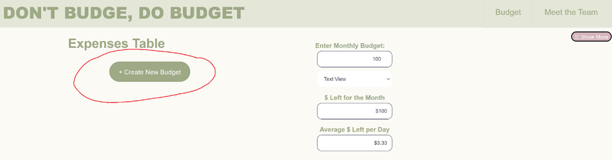
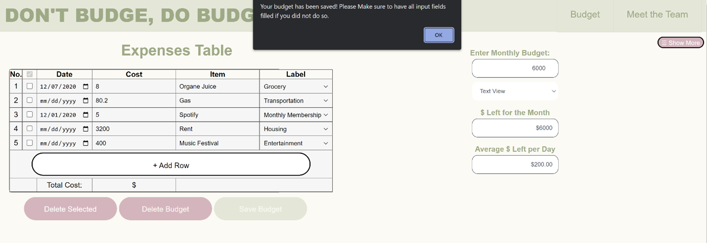
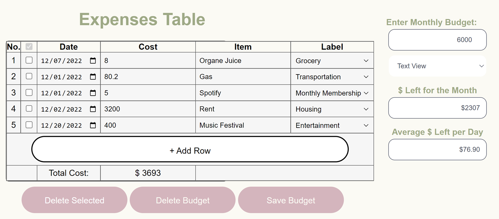
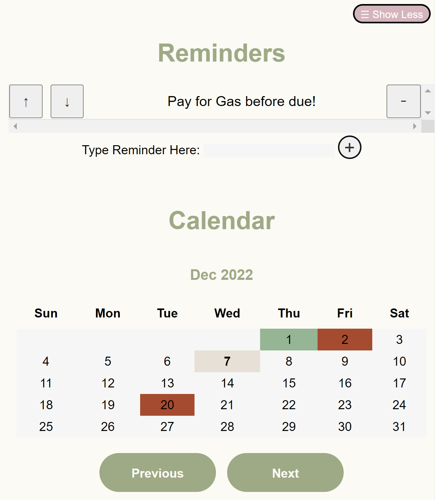

# HARDCORE 34's Project for CSE 110 FA '22

### DON'T BUDGE, DO BUDGET WEB PAGE: [DON'T BUDGE, DO BUDGET](https://cse110-fa22-group34.github.io/cse110-fa22-group34/source/index.html)

This document contains a general guide of our repository and an overview of our project.

## Final Video Links

- [Final Video Public Version](https://youtu.be/eS0JrPJg_6M)
- [Final Video Private Version](https://youtu.be/P86Tm74DtRE)
  - Due to the time restriction, more information on our workflow and onboarding is written below in this README file.
  - An explanation of our build process can be found [here](./admin/cipipeline/phase1.md).
  - A short demo of our workflow can be found in our [cipipeline demo](./admin/cipipeline/phase1.mp4).

## Explanation of Our Project
[Starting Pitch](https://github.com/cse110-fa22-group34/cse110-fa22-group34/blob/main/specs/pitch/CSE%20110%20Team%2034%20Pitch%20Presentation.pdf)

As a team of college students, we created a project that will help address a common problem for most university students: financing and budgeting. Our budgeting web application provides several features, including:
- Input monthly budget limit and expenses (categorized by date, title, cost, and category)
- View the remaining budget and average daily spending allowed to meet the monthly goal
- View visual representations (pie chart, line graph, and an animated character) for the breakdown of the spending and remaining budget
- Add, delete, and update Reminders (Any Due Payments, Credit Card Bills, etc.)
- View the Calendar with the dates colored to represent spending on that particular day (ranging from dark red to dark green - red meaning spending over the allocated daily budget and green meaning spending below that allocated daily budget)

## Tutorial
1. After you open the application and feel ready, click on “Create Budget.” 
2. Input your data into the expense table and click on “Save Budget” and input your budget for the month. You will see an alert that pop out. 
3. You will then see that your total cost and your budget as well as your average budget per day left for the month. 
4. You can click on “Show More” to see visualization of your budget status and create reminders. 

## Design of Our Repo
These are the folders in our project repo and the materials they contain.

Admin Folder:
- branding : includes our team logo and our branding
- cipipeline : includes image of our cipipeline and a video explaining it
- meetings : includes all our meeting notes (including spring meetings and retrospectives)
- misc : includes our rules and a copy of us signing them
- pictures : includes all our images for the team.md file and team.html page
- videos : includes our (class-featured) team intro video and our agile spring status videos
- team.md : a version of our team page in markdown format

Source Folder:
- <ins>tests</ins> : includes all our tests for our program. They are jest tests.
- assets : includes the character images used in our visualization section
- scripts : includes all javascript files for our website
- styles: includes all css files for our website
- index.html : our main html page for the budget
- team.html : the team html page

Specs Folder:
- adr : includes all our Architectural
- brainstorm: includes the brainstorming activity we did using Miro
- pitch: includes pitch presentation, wireframe, and diagram
- retrospectives: retrospectives documents
- sprint-1-review: includes screenshots/videos of everyone’s progress in sprint1
- sprint-2-review: includes screenshots/videos of everyone’s progress in sprint 2
- sprint-3-review: includes screenshots/videos of everyone’s progress in sprint 3
- tutorial: includes screenshots of the steps of using the website

## Design Choices
[ADR Folder](./specs/adr)
1. [Programming Protocols](./specs/adr/110622-ProgrammingProtocols.md)
2. [Accessibility](./specs/adr/111322-AccessibilityDecision.md)
3. [File Organization](./specs/adr/112222-FileOrginization.md)
4. [Layout](./specs/adr/120122-LayoutDecisions.md)

## Meet the Team:
- [The Team](./admin/team.md)
- [Team Intro Video](./admin/videos/teamintro.mp4)
- The [“Meet The Team”](https://cse110-fa22-group34.github.io/cse110-fa22-group34/source/team.html) page on our budget web app introduces all developers who took part in this project and incorporates our team logo.

## Timeline
1. [Brainstorm](./specs/brainstorm/Miro_Brainstorm.pdf)
2. [Pitch](https://github.com/cse110-fa22-group34/cse110-fa22-group34/blob/main/specs/pitch/CSE%20110%20Team%2034%20Pitch%20Presentation.pdf)
3. [CI Pipeline](./admin/cipipeline): [Diagram](./admin/cipipeline/phase1.drawio.png), [Explanation](./admin/cipipeline/phase1.md), [Demo](./admin/cipipeline/phase1.mp4)
4. [Sprint 1](./admin/meetings/111322-sprint-1-review.md)
5. [Retrospective 1](./admin/meetings/111322-retrospective.md)
6. [Sprint 2](./admin/meetings/112022-sprint-2-review.md)
7. [Retrospective 2](./admin/meetings/112122-retrospective.md)
8. [Sprint 3](./admin/meetings/120122-sprint-3-review.md)

## Meeting Notes
[Meeting Notes Folder](./admin/meetings)
