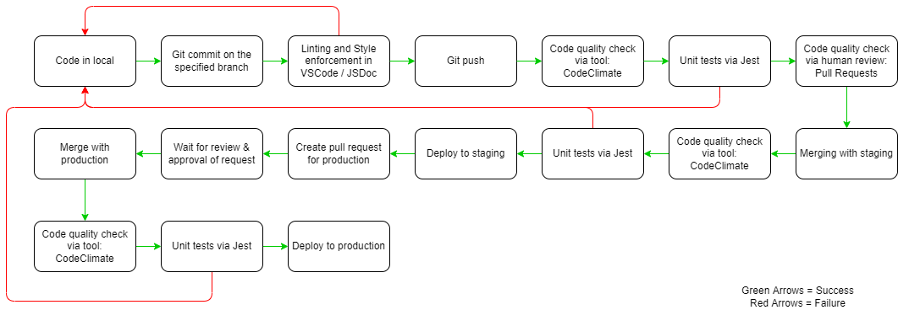

# Pipeline: Phase 1

### Overview

**Continuous Integration (CI)** is a software development practice where developers integrate code into a shared repository frequently, preferably several times a day. Each check-in is then verified by an automated build, allowing teams to detect problems early. Benefits include:

- Smaller, more frequent code reviews
- Early detection of bugs
- Continuous feedback on code quality
- Fewer merge conflicts and integration issues

**Continuos Delivery (CD)** is a process which allows developers to deliver bug fixes, features, and configuration changes to production environments with a high degree of automation and frequency. Benefits include:

- Faster bug fixes and feature releases
- Lower-risk releases
- Faster user feedback and unit testing

### Decisions

1. Style Enforcement: The Programming Protocol that we decided upon to format code and style (can be found [here](https://docs.google.com/document/d/1Uu9b8ZCIqOO-5X6AvtKVeQJ8IfKtS3wf3Mv8oLrjvGY/edit). 
2. Code Quality via Tool: We decided to use Code Climate to enforce code quality standards - [Code Climate](https://codeclimate.com/).
3. Code Quality via Human Review: We decided to use Pull Requests and pair-programming practices to enforce code quality standards. We also discussed and came up with a list of best practices for code reviews, listed [here](https://docs.google.com/document/d/1Uu9b8ZCIqOO-5X6AvtKVeQJ8IfKtS3wf3Mv8oLrjvGY/edit).
4. Unit Testing via Automated Tool: We decided to use Jest to enforce unit testing standards: write tests using a familiar and feature-rich API to get fast results - [Jest](https://jestjs.io/).
5. Document Generation via Automated Tool: We decided to use JSDoc to enforce documentation standards: JSDoc is a standard for documenting JavaScript code - [JSDoc](https://jsdoc.app/).

### Progress

- We have a structure for our codebase, which includes the following folders:
-- `src` - contains all of our source code
    - `scripts` - contains all of our JS scripts
    - `styles` - contains all of our CSS styles
    - `index.html` - contains the main HTML for our website

- We have begun working on the front-end of our website, dividing up main components of the home page into separate files (CSS and JS). We have divided up the task of completing the components in pairs, following one coherent UI design and style. 

- We have began discussing the back-end of our website, and have decided to utilize LocalStorage to save user data and avoid needing Authentication.

- We faced a few issues with merging our code, but we figured out the source of the issue and have since been able to begin merging our code without too many conflicts.

